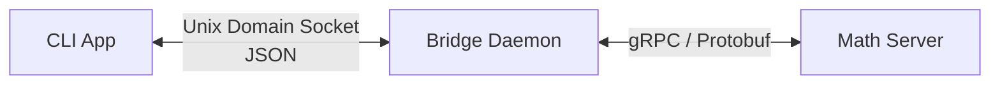

# grpc-math-bridge

A Rust-based gRPC math service with a Unix domain socket bridge and CLI client.




## System Requirements

- Linux
- Rust 1.98.1
- protoc 35.0 (https://protobuf.dev/downloads/)
- `socat` (optional, for manually testing the Unix socket)

## Build

Clone the repository and build the complete workspace:

```bash
cargo build --workspace
```

## Crates

### Server

The server crate contains the gRPC server.

To run the server:

```bash
cargo run --bin server
```

The server provides a CLI interface for configuring the host address and port. Run:

```bash
cargo run --bin server -- -h
```

to display the available options.

The host and port can also be configured using environment variables:

- `MATH_GRPC_HOST` — the host IP address
- `MATH_GRPC_PORT` — the host port

These environment variables are used when they are set and no corresponding CLI arguments are specified.

CLI arguments take precedence over environment variables.

### Daemon

The daemon acts as a bridge between a Unix socket and the gRPC math service.

To run the daemon, provide the path to a configuration file:

```bash id="wrrzh3"
cargo run --bin daemon -- config.json
```

The configuration file is required and has the following structure:

```json id="b2f63x"
{
  "grpc_address": "http://127.0.0.1:50051",
  "socket_path": "/tmp/math.sock"
}
```

A connection to the daemon can be established using the configured Unix socket.

The Unix socket can be tested using `socat`:

```bash id="nh16kp"
socat - UNIX-CONNECT:/tmp/math.sock
```

Once the connection is established, requests can be sent as JSON messages. For example:

```json id="e5d3su"
{"version":"1.0","command":"ADDITION","data":{"lhs":10.0,"rhs":5.0}}
```

The daemon processes the request, forwards the corresponding operation to the gRPC server, and returns the result over the Unix socket.

See the [Unix Socket Protocol Specification](crates/protocol/specification.md) for details about the protocol.


## Protocol

The communication between the client and daemon uses a JSON-based protocol over a Unix socket.

The protocol defines the available math commands, request and response formats, error responses, and protocol versioning.

See the [Unix Socket Protocol Specification](crates/protocol/specification.md) for details.


### CLI App

The CLI app provides a command-line interface for communicating with the daemon over the Unix socket.

Before running the CLI app, make sure the daemon is running and listening on the configured Unix socket.

To evaluate a math expression:

```bash id="0ghfks"
cargo run --bin cli-app -- "1 + 1"
```

The CLI app supports the following operators:

- `+` — Addition
- `-` — Subtraction
- `*` — Multiplication
- `/` — Division

For example:

```bash id="itpug8"
cargo run --bin cli-app -- "10.5 * 2"
```

By default, the CLI app connects to `/tmp/math.sock`. A different Unix socket can be specified using `--socket-path`:

```bash id="4f0s65"
cargo run --bin cli-app -- --socket-path /tmp/custom.sock "10 / 2"
```

The CLI app communicates with the daemon using the [Unix Socket Protocol Specification](crates/protocol/specification.md).


## Quality Gates

The project uses the following quality gates:

- Check code formatting:
  ```bash
  cargo fmt --all -- --check
  ```

- Run Clippy:
  ```bash
  cargo clippy --workspace --all-targets --all-features -- -D warnings
  ```

- Check for unused dependencies:
  ```bash
  cargo install cargo-machete --locked
  cargo machete
  ```

- All tests must succeed:
  ```bash
  cargo test --workspace --all-features
  ```

- Lint Protocol Buffer definitions:
  ```bash
  protolint lint proto/
  ```


## Logging

All crates use `tracing` for logging. The log level can be configured using the `RUST_LOG` environment variable.

For example, to enable `info`-level logging when running the server:

```bash
RUST_LOG=info cargo run --bin server
```

Other log levels, such as `debug`, `warn`, or `error`, can be configured in the same way.