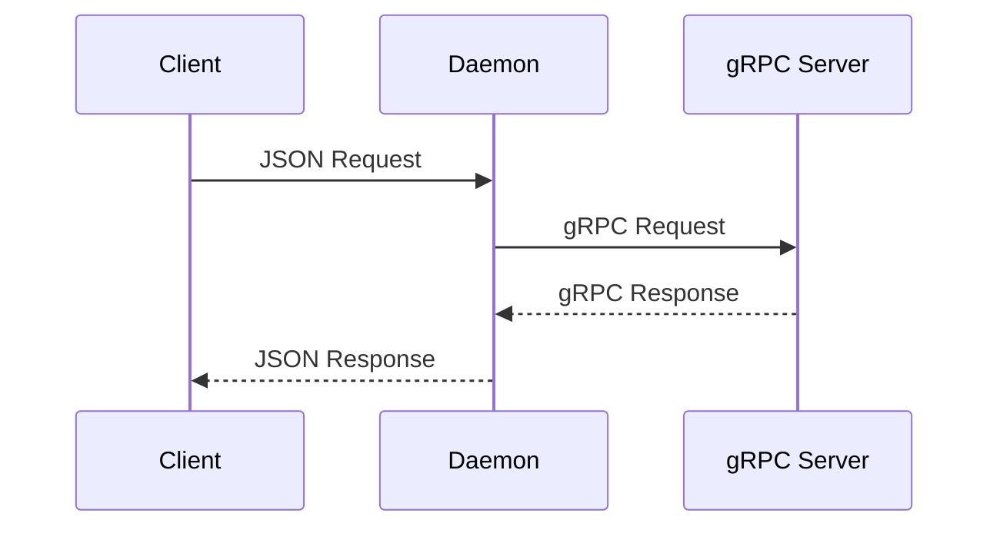

# Unix Socket Protocol

## Overview

The Unix socket protocol is used for communication between a client and the daemon.

The client sends a JSON request containing a math command and its operands. The daemon processes the request using the gRPC math service and returns a JSON response containing either the result or an error.



The current protocol version is `1.0`.

### Message Framing

Messages are encoded as UTF-8 JSON and terminated by a newline character (`\n`).

Each connection contains a single request followed by a single response.


## Request

A request is encoded as a JSON object with the following structure:

```json
{
  "version": "1.0",
  "command": "ADDITION",
  "data": {
    "lhs": 10.0,
    "rhs": 5.0
  }
}
```

The request contains:

| Field | Type | Description |
| --- | --- | --- |
| `version` | string | Protocol version. Currently `1.0`. |
| `command` | string | Math operation to execute. |
| `data` | object | Operands for the operation. |
| `data.lhs` | number | Left-hand operand. |
| `data.rhs` | number | Right-hand operand. |

### Commands

The following commands are supported:

| Command | Operation |
| --- | --- |
| `ADDITION` | `lhs + rhs` |
| `SUBTRACTION` | `lhs - rhs` |
| `MULTIPLICATION` | `lhs * rhs` |
| `DIVISION` | `lhs / rhs` |

For example, an addition request is:

```json
{
  "version": "1.0",
  "command": "ADDITION",
  "data": {
    "lhs": 10.0,
    "rhs": 5.0
  }
}
```

## Response

The daemon returns either a `RESULT` or an `ERROR` response.

Every response contains the protocol version used by the daemon.

### Result

A successful operation returns:

```json
{
  "version": "1.0",
  "type": "RESULT",
  "data": {
    "result": 15.0
  }
}
```

The response contains:

| Field | Type | Description |
| --- | --- | --- |
| `version` | string | Protocol version. Currently `1.0`. |
| `type` | string | Response type. `RESULT` for a successful operation. |
| `data.result` | number | Result of the math operation. |

### Error

If the operation cannot be completed, the daemon returns:

```json
{
  "version": "1.0",
  "type": "ERROR",
  "data": {
    "error": "division by zero"
  }
}
```

The error response contains:

| Field | Type | Description |
| --- | --- | --- |
| `version` | string | Protocol version. Currently `1.0`. |
| `type` | string | Response type. `ERROR` when an operation fails. |
| `data.error` | string | Description of the error. |